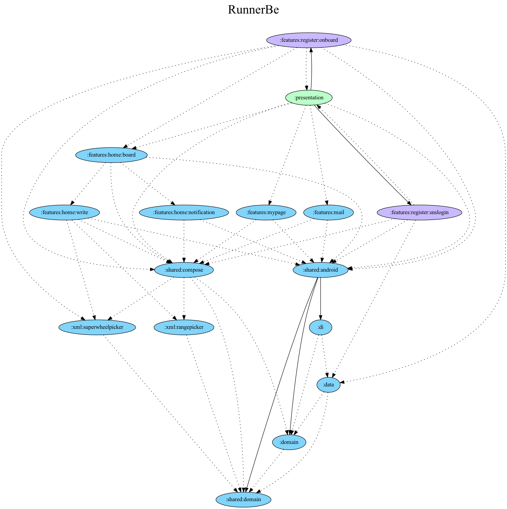
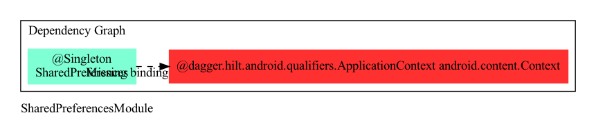
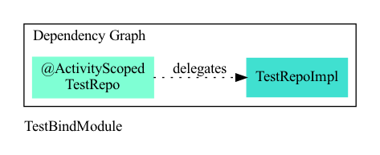
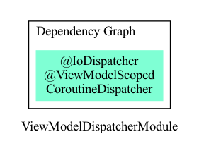

<h1 align="center">RunnerBe</h1>

직장인 타겟 러닝 모임 O2O 플랫폼 🐝

  
  
  
  
   
  
  
  
  

---

## Tech Skill

#### Architecture

- Layered Architecture
- MVW Pattern
- Dynamic Feature Module
- TDD

#### CI/CD

- Github Action
- Fastlane + Firebase App Distribution

#### Jetpack

- Hilt
- Paging
- WorkManager
- CameraX
- DataStore

#### Design System

- [Honeycomb](https://github.com/applemango-runnerbe/honeycomb)

#### Test

- JUnit5
- Hamcrest
- kotlinx-coroutines-test

#### Etc

- GMS
- Retrofit, OkHttp
- Coroutine/Flow
- WindowInsets

## Layer

#### Project Dependencies

  
   
  

#### Dependency Injection Graph **(TEST MODULE)**

> TODO

## Developer

|     [@jisungbin](https://github.com/jisungbin) - Android     |  [@parkchanho](https://github.com/great-park) - Server  |
| :----------------------------------------------------------: | :-----------------------------------------------------: |
|  |   |
| **[@kimeunseo](https://github.com/plannermango) - Planner**  |         **[@kimseojeong](README.md) - Design**          |
|         |  |

---

## License

RunnerBe는 MIT 라이선스를 따릅니다. 자세한
내용은 [LICENSE](https://github.com/applemango-runnerbe/RunnerBe-Android/blob/main/LICENSE) 파일을 확인해
주세요.
