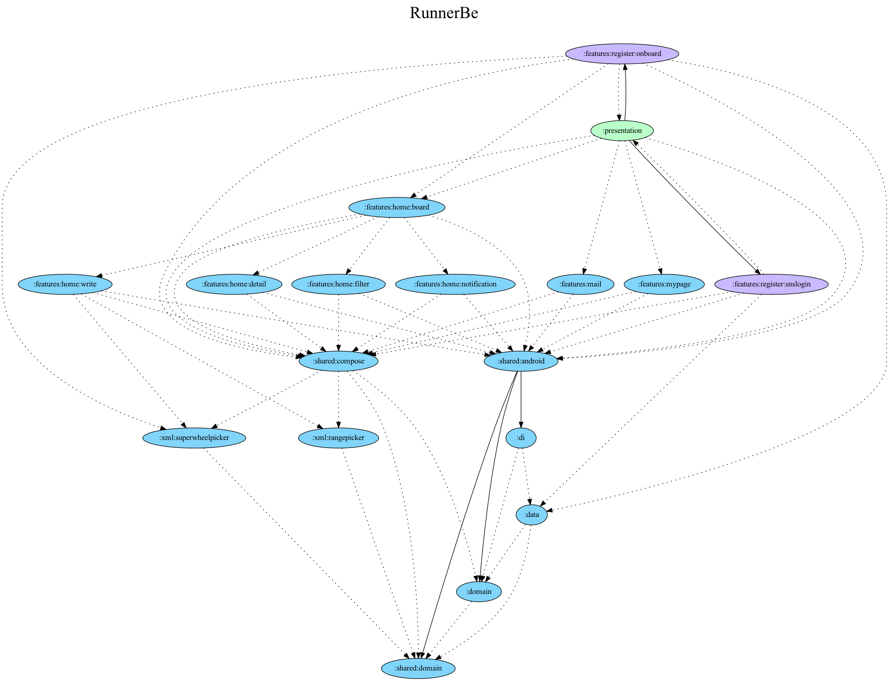

  

직장인 타겟 러닝 모임 O2O 플랫폼 🐝

  
  
  
   
  
  
  
   
  
   
  
  

---

# 🥇 마지막 실력 향상 프로젝트

토스/뱅샐/당근 에 지원(2022년 12월 26일)하기 전에, 마지막으로 진행하는 *엄청난* 실력 향상용 프로젝트 입니다. (엄청난 실력 향상의 변천사: 중3, 고2, 이 프로젝트 이후 예정)

따라서 **아키텍처가 다소 오버하게 적용**됐으며, 아래와 같은 기술들을 처음 적용합니다.

- DFM
- ~~TDD~~
- Test + [Test Coverage 100% 목표](https://github.com/runner-be/RunnerBe-Android/issues/35)

# 🐛 아키텍처 이슈

현재 아키텍처에 다양한 이슈들이 존재합니다. 이슈 해결을 포함한 모든 이슈나 PR 은 항상 환영입니다.

# ✍️ 작성 아티클

- [안드로이드12 스플래시 대응하기](https://sungbin.land/%EC%95%88%EB%93%9C%EB%A1%9C%EC%9D%B4%EB%93%9C12-%EC%8A%A4%ED%94%8C%EB%9E%98%EC%8B%9C-%EB%8C%80%EC%9D%91%ED%95%98%EA%B8%B0-1729f69dc33f)
- [안드로이드 테스트 앱 자동배포 하기](https://sungbin.land/fastlane-firebase-app-distribution-ff57c15793a4)
- [안드로이드 프로젝트 의존 그래프 만들기](https://sungbin.land/%EC%95%88%EB%93%9C%EB%A1%9C%EC%9D%B4%EB%93%9C-%ED%94%84%EB%A1%9C%EC%A0%9D%ED%8A%B8-%EC%9D%98%EC%A1%B4-%EA%B7%B8%EB%9E%98%ED%94%84-%EB%A7%8C%EB%93%A4%EA%B8%B0-41adfe141622)
- [안드로이드 Dynamic Feature Module 적용하기](https://sungbin.land/%EC%95%88%EB%93%9C%EB%A1%9C%EC%9D%B4%EB%93%9C-dynamic-feature-module-%EC%A0%81%EC%9A%A9%ED%95%98%EA%B8%B0-6001654155d2)
- [Jetpack Compose 뒤로가기 이벤트 처리하기](https://sungbin.land/jetpack-compose-%EB%92%A4%EB%A1%9C%EA%B0%80%EA%B8%B0-%EC%9D%B4%EB%B2%A4%ED%8A%B8-%EC%B2%98%EB%A6%AC%ED%95%98%EA%B8%B0-69cbc47268ea)
- [Jetpack Compose 에서 Flow 효율적으로 수집하기](https://sungbin.land/jetpack-compose%EC%97%90%EC%84%9C-flow-%ED%9A%A8%EC%9C%A8%EC%A0%81%EC%9C%BC%EB%A1%9C-%EC%88%98%EC%A7%91%ED%95%98%EA%B8%B0-661fef213ced)
- [Jetpack Compose 완벽한 커스텀 다이얼로그 만들기](https://sungbin.land/jetpack-compose-%EC%99%84%EB%B2%BD%ED%95%9C-%EC%BB%A4%EC%8A%A4%ED%85%80-%EB%8B%A4%EC%9D%B4%EC%96%BC%EB%A1%9C%EA%B7%B8-%EB%A7%8C%EB%93%A4%EA%B8%B0-79aab4c3023e)
- [Jetpack Compose 갤러리/카메라 에서 사진 가져오기](https://sungbin.land/jetpack-compose-%EA%B0%A4%EB%9F%AC%EB%A6%AC-%EC%B9%B4%EB%A9%94%EB%9D%BC-%EC%97%90%EC%84%9C-%EC%82%AC%EC%A7%84-%EA%B0%80%EC%A0%B8%EC%98%A4%EA%B8%B0-cf517eaca8bd)
- [kotlin dokka 로 문서 자동 생성하기](https://jisungbin.medium.com/kotlin-dokka-%EB%A1%9C-%EB%AC%B8%EC%84%9C-%EC%9E%90%EB%8F%99-%EC%83%9D%EC%84%B1%ED%95%98%EA%B8%B0-84487e7e9f4)
- [common.gradle 로 중복되는 그레이들 코드 없애기](https://sungbin.land/common-gradle-%EB%A1%9C-%EC%A4%91%EB%B3%B5%EB%90%98%EB%8A%94-%EA%B7%B8%EB%A0%88%EC%9D%B4%EB%93%A4-%EC%BD%94%EB%93%9C-%EC%97%86%EC%95%A0%EA%B8%B0-54ab069e1d15)
- [누가 내 앱의 용량을 많이 차지하고 있을까?](https://sungbin.land/%EB%88%84%EA%B0%80-%EB%82%B4-%EC%95%B1%EC%9D%98-%EC%9A%A9%EB%9F%89%EC%9D%84-%EB%A7%8E%EC%9D%B4-%EC%B0%A8%EC%A7%80%ED%95%98%EA%B3%A0-%EC%9E%88%EC%9D%84%EA%B9%8C-3f2529200024)
- [ktlint, detekt 으로 코드 퀄리티 향상시키기](https://sungbin.land/ktlint-detekt-%EC%9C%BC%EB%A1%9C-%EC%BD%94%EB%93%9C-%ED%80%84%EB%A6%AC%ED%8B%B0-%ED%96%A5%EC%83%81%EC%8B%9C%ED%82%A4%EA%B8%B0-a085c7eba2cd)
- [Github Actions 으로 안드로이드 CI/CD 구축하기](https://sungbin.land/github-actions-%EC%9C%BC%EB%A1%9C-%EC%95%88%EB%93%9C%EB%A1%9C%EC%9D%B4%EB%93%9C-ci-cd-%EA%B5%AC%EC%B6%95%ED%95%98%EA%B8%B0-1aaaa6595c4a)
- [gradle 멀티 모듈 프로젝트에 JaCoCo 설정하기](https://jisungbin.medium.com/gradle-%EB%A9%80%ED%8B%B0-%EB%AA%A8%EB%93%88-%ED%94%84%EB%A1%9C%EC%A0%9D%ED%8A%B8%EC%97%90-jacoco-%EC%84%A4%EC%A0%95%ED%95%98%EA%B8%B0-76e69f2afb40)
- 러너비 안드로이드 개발 회고 [예정]
- 테스트 커버러지 100% 까지의 여정 [예정]

# 🔖 코드 설명

> 작성 중

---

## Tech Skill

#### Architecture

- ~~TDD~~
- MVI Pattern
- Layered Architecture
- Dynamic Feature Module (:features:register)

#### CI/CD

- Github Actions
- Firebase App Distribution

#### Jetpack

- Hilt
- Room
- Compose
- DataStore
- Navigation

#### Test

- JUnit5
- Hamcrest
- kotlinx-coroutines-test

#### Etc

- GMS
- WindowInsets
- Coroutine/Flow
- Retrofit, OkHttp

## Layer

#### Project Dependencies Graph

  
   
  

#### Dependency Injection Graph

> TODO

## Developer

> [2월 4일] 개발 시작

- **[PM]** [@jisungbin](https://github.com/jisungbin)

---

## 회고 중간 기록

- **백엔드의 숙련도가 중요하다는걸 매우 느꼈고, 왜 백엔드 경력만 5년 이상으로 뽑는지 알 거 같다.**
- [mapper](https://github.com/runner-be/RunnerBe-Android/blob/f0855a490f90c1b0f668f9aeb2cd3b60e6c5fd75/data/src/main/kotlin/team/applemango/runnerbe/data/main/mapper/mapper.kt) 만드는게 제일 귀찮다.
- 혼자서 이 큰 걸 개발하니까 아키텍처 설계에서 막히는 부분을 물어볼 사람이 없어서 너무 슬프다.
- 계속 원치 않는 파일까지 커밋이 돼 버린다!! 커밋 메시지 어떡해...
- 우선순위와 후순위를 확실하게 정하고 맞춰서 개발하자. 
- 한 번 만들기로 한 기능이 있으면 딱 그 기능만 만들고, 개발 중에 하고 싶은게 생겼다고 합쳐서 한 번에 개발하지 말자.
- 토스 때문에 이러고 있는데, 결국 토스에 떨어지면 그동안 한 노력들이 다 똥되니 지원하기 전 까지는 어떻게든 다 하자.
- 어떻게 해야 할 지 모르겠을땐 그냥 무작정 생각나는데로 해보자~ 시간이 낭비되더라도 결국엔 깨닫게 된다.
- 힘들때 마다 나도 모르게 항상 생각하면서 버티고 있는 "토스 가야 돼..." 진짜 꼭 가고싶다.

## License

RunnerBe는 MIT 라이선스를 따릅니다. 자세한 내용은 [LICENSE](https://github.com/runner-be/RunnerBe-Android/blob/main/LICENSE) 파일을 확인해 주세요.
